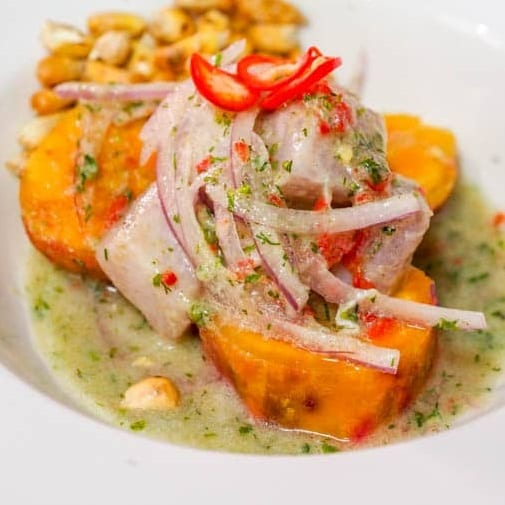
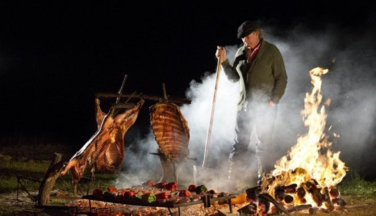
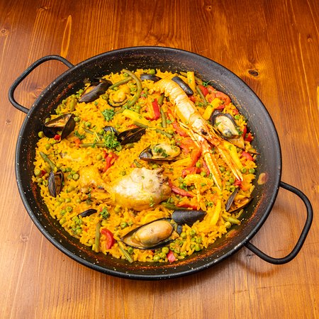

# My Favorite Dishes
## Ceviche 

* **A Brief History of Ceviche**
  * Peruvian ceviche, a UNESCO Intangible Cultural Heritage, has origins dating back over 2,000 years to coastal pre-Inca cultures like the Moche, who marinated raw fish in fermented banana passionfruit juice (tumbo). The dish evolved with ***Inca***, ***Spanish***, and ***Japanese*** influences, replacing acidic fruits with Mediterranean limes and adopting modern quick-marinating techniques.
   
* **Origins and Evolution**

  * **Ancient Roots (Pre-Inca):** Evidence from the Moche civilization (approx. 100–700 AD) suggests raw fish was marinated with salt and the fermented juice of local Andean citrus-like fruits known as tumbo.
  Inca Period: The Inca empire reportedly used fermented corn beverages (chicha) to marinate fish, sometimes referred to as siwichi.
  * **Spanish Influence (16th Century):** Spanish conquistadors brought sour oranges, lemons, and onions. These ingredients merged with local traditions, leading to the use of lime (imported by the Spanish) as the standard curing agent, which acts to firm the fish without heat.
  * **Japanese Influence (19th Century):** The arrival of Japanese immigrants is credited with modernizing the dish, reducing the marination time, and focusing on an almost raw, sashimi-style preparation.
  * **Modern Peruvian Ceviche** Today, the dish is recognized as a staple of Peruvian national identity, celebrated on June 28th as national Ceviche Day. 
  
* **Recipe**
  * This classic Peruvian ceviche recipe by chef **Gastón Acurio** centers on fresh white fish, lime juice, salt, chili, onions, and cilantro, served with sweet potato and corn. The key is to avoid squeezing limes too hard (to prevent bitterness) and to marinate for only a few minutes to keep the fish tender.
  * [recipe](https://misaboraperu.wordpress.com/2014/04/13/peruvian-ceviche-recipe-by-gaston-acurio-chef-cevicheria-la-mar/)

* **Recommended restaurant**
  * Jarana 1 american Dream Wy, East Rutherford, NJ 
  * [jarana](https://jaranarestaurant.com/new-jersey/)
 
  * Fusionista 14 park, Monclair , NJ
  * [fusionista](https://fusionistarestaurant.com/)
 
  * Ceviche517 517 river Dr. Garfield NJ* 
  * [ceviche517](https://www.ceviche517piscolounge.com/)

## Argentinian Asado

* **A brief History of Argentinian Asado**
  * The Argentinian asado is a deeply rooted cultural tradition originating in the 17th-century pampas, where **nomadic gauchos (cowboys)** developed a technique of slow-grilling beef over open wood fires. Influenced by Spanish cattle introduction and indigenous cooking methods, this social, fire-fueled ritual matured from a rustic staple into a national identity, focusing on low-heat cooking of various meat cuts. 

* **Origins**
  * **Key Historical & Cultural Aspects:**
    * **The Gaucho Legacy:** Originating in the 17th century, gauchos traveled with cattle and perfected grilling every part of the animal, often using quebracho wood for intense, smoky flavor.
    Techniques: Traditional methods include al asador (whole carcass on a vertical stake) or a la parrilla (over a grill).
  
    *  **Social Ritual:** Today, the asado is a crucial weekend ritual for family and friends, managed by an asador (grill master) who prepares cuts like tira de asado (short ribs) and vacio (flank).
    * **Evolution:** While historically rustic, it adapted to include sausages (chorizo) and offal (mollejas), and spread from the rural plains into urban, high-end, and casual restaurant culture. 

   * Asado goes beyond just food, it is a key component of Argentine social life, often seen as a bonding experience during challenging economic time
 
* **Recipe**
  * An authentic Argentinian asado is a slow-cooked barbecue feast focusing on high-quality beef (short ribs, flank steak) and sausages, seasoned simply with coarse salt (sal parrillera) and cooked over wood or charcoal embers. Key components include tira de asado (flanken-cut ribs), vacío (flank), chorizo, and morcilla (blood sausage), served with chimichurri sauce. 
  * **Classic Argentinian Asado Recipe (Tira de Asado)**
  * **Prep Time:** 15 mins
  **Cook Time:** 1-2 hours
  *  *Ingredients:** Thin flanken-cut short ribs (tira de asado), flank steak (vacio), chorizos, coarse salt.
  **Chimichurri**: Mix 1 cup parsley, 6 cloves garlic (minced), 1 tbsp oregano, 1 tsp chili flakes, 1/4 cup red wine vinegar, 1/2 cup olive oil, salt, and pepper. 

  * **Instructions:**

    **Prepare the Fire:** Light wood or charcoal, letting it burn down to hot embers. The grill should be low heat.
    **Season:** Season meat liberally with coarse salt.
    **Grill:** Place meat on the grill. Start with thicker cuts and chorizos. Grill on low heat, flipping occasionally, for roughly 45-60 minutes for medium, until fat renders.
    **Rest:** Allow the meat to rest for 10 minutes before carving.
    **Serve:** Slice and serve immediately with chimichurri. 
 

* **Recommended restaurant** 
  * **La Fusta** 1110 Tonnelle Ave,North Bergen, NJ
  * [la fusta](https://lafustanj.com/)

  * **Choripan Rodizio** 10 Sussex st. Hackensack nj
  * [choripan](https://www.choripannj.com/)

## Paella
 
 
* **A Brief History of Paella**
  * Paella originated in the 15th-century Valencia region of Spain,  culinary icon. Originally made with rice, snails, and beans, the dish used locally available ingredients, with rabbit or duck added for special occasions. The name refers to the wide, shallow pan used to create the signature crispy crust, socarrat. 

* **Origins**
  * **Key Historical Points**

  * **Origins:** The dish emerged near Lake Albufera in Valencia, a significant rice-producing area. It was considered a peasant food, created by laborers needing a portable, filling meal.
  * **Name Origin:** "Paella" stems from the old Valencian word for the flat, wide pan used, which itself is derived from the Latin word patella.
  * **Influences:** The dish is a blend of Roman (the pan) and Arab (rice cultivation in the 8th century) influences.
  * **Traditional vs. Modern:** Traditional Paella Valenciana consists of chicken, rabbit, duck, and beans, not seafood. Seafood paella, or paella de marisco, originated later in the coastal communities of Valencia.
  * **Cultural Significance:** Traditionally cooked over an open orange-wood fire, it is a communal, social meal meant to be shared. 

* **Recipe**
  * [paella](https://www.billyparisi.com/easy-seafood-paella-recipe/)
  

  